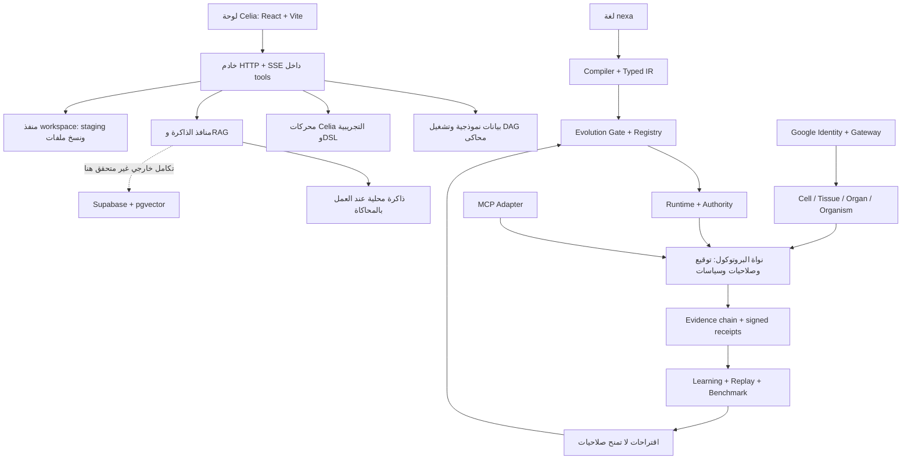
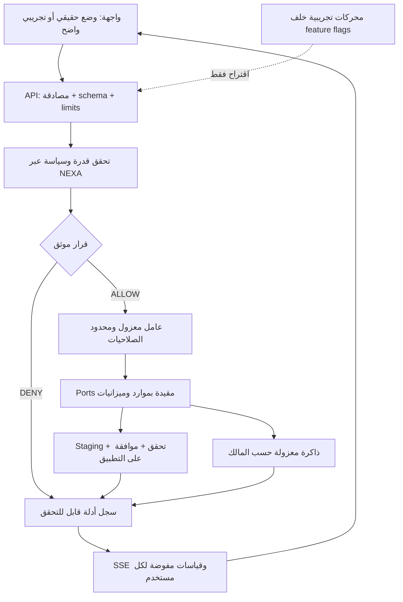

# NEXA — مخطط الإنجاز وخطة التطوير والتحسين

> **خطة توسعة جديدة — دون تنفيذ:** أُعدت [خطة فجوات للبنود الـ200](nexa-capability-expansion-plan.ar.md)، مع [مصفوفة كاملة](nexa-capability-matrix.ar.md) و[CSV](nexa-capability-matrix.csv). تميز الموجود المحدود والجزئي والمحاكاة وما لم يظهر تنفيذه، وتبدأ بإغلاق H2/H3 قبل توسيع التنفيذ. التصنيف ليس نسبة إنجاز، وحالة الاختبارات السابقة لم تتغير بهذه الوثائق.

> **تحديث لاحق بطلب المستخدم — تعلّم خطط الإصلاح:** أضيفت [وحدة جمع وتدريب استشاري معزولة](celia-adaptive-learning.ar.md)، مع ML وشبكة صغيرة متعددة الطبقات. المجموعة الحقيقية فارغة ولا نموذج مستخدم مدرّب. 18 اختبارًا جديدًا و59 اختبار انحدار ناجحة؛ verify الحالي **392 PASS / 2 FAIL من 394**، والفشلان H2/H3. لا صلاحيات تنفيذ جديدة ولا تراجع عن منع النشر.

> **حزمة H1-PERSISTENCE — قياس مرحلتها:** [الدليل والحدود التشغيلية](celia-workspace-commit-h1-persistence.ar.md). H1 الأصلي و20 اختبار استمرارية و39 اختبارًا سابقًا نجحت. H2 وH3 ما يزالان RED. verify في تلك الحزمة: **374 PASS / 2 FAIL من 376**. يلزم مخزن استهلاك دائم خارج root؛ التفاصيل التاريخية أدناه لا تعني اجتياز الحدود الثلاثة الآن.

**تاريخ المراجعة:** 20 سبتمبر 2026  
**النسخة المرجعية:** `4e2f018`، فرع العمل `arena/01a0bf94-nexa`  
**نوع العمل:** مراجعة الشفرة وتشغيل فحوص محلية، ثم إعداد خطة؛ لم تُطبّق إصلاحات تشغيلية أو تغييرات قواعد بيانات أو عمليات نشر.

> **الخلاصة:** للمشروع نواة بروتوكول وأمان ذات اختبارات ناجحة، فوقها طبقة Celia واسعة تحتوي تنفيذًا تجريبيًا ومحاكاة وتكاملات غير مثبتة تشغيليًا في هذه المراجعة. الأولوية هي تثبيت الحدود الأمنية وربط المنتج بالنواة، لا إضافة محركات أخرى الآن. لا يمكن ضمان «بلا مشاكل»، لكن يمكن منع الإطلاق عند فشل معايير قبول واضحة، وتقليل المخاطر بالتدرج والتراجع القابل للاختبار.

**تحديثات لاحقة لخط الأساس:** أُصلح WRITE بعد [RED موثق](celia-workspace-red-test.ar.md)، ثم أُثبت [COMMIT RED](celia-workspace-commit-red.ar.md) وأُصلح بعقد مستقل يربط التفويض بحالة الملفات. بلغت نتيجة جولة العقد المحدود **353/353 اختبارًا ناجحًا**: 314 baseline و17 WRITE و22 COMMIT. **لاحقًا أضيفت H1/H2/H3 وفشلت تشغيليًا**؛ أُعيدت الحزمة السابقة ذات الصلة ونجحت 39/39، دون إعادة المجموعة الكاملة. راجع [دليل COMMIT HARDENING RED](celia-workspace-commit-hardening-red.ar.md). راجع [دليل COMMIT GREEN وحدوده](celia-workspace-commit-green.ar.md) و[دليل WRITE](celia-workspace-write-authorization.ar.md). نتائج 314/314 والجداول أدناه توثق المراجعة الأولية؛ create وبقية مسارات التعديل وSupabase ما تزال خارج الإصلاح، ولا جاهزية للنشر العام.

## 1. كيف نقرأ مستوى الإنجاز؟

- **مثبت محليًا:** الشفرة موجودة والفحوص المعنية نجحت في هذه البيئة؛ ليس شهادة أمان أو جاهزية إنتاج شاملة.
- **منفذ جزئيًا:** توجد وحدات ومسارات فعلية، لكن التكامل أو الاستمرارية أو الاختبارات غير مكتملة.
- **محاكاة/تجريبي:** بيانات نموذجية أو خوارزمية توضيحية؛ لا يُعد إثباتًا لقدرة تقنية تحمل الاسم نفسه.
- **غير متحقق هنا:** يحتاج تشغيل خدمات خارجية أو بناء واجهة أو اختبار نشر لم يُنفذ في هذه المراجعة.

## 2. مخطط ما هو موجود الآن



**حد مهم:** الرسم لا يفترض أن كل مسارات API تمر بالنواة. توجد استدعاءات مباشرة من خادم اللوحة إلى المنافذ؛ توحيد مسار التفويض هو عمل مطلوب. كما أن `6 CLOSED` تصف بوابات النواة، لا تعني أن كل ما في `tools/` عاجز عن الكتابة أو تشغيل عمليات.

## 3. الإنجاز بالتفصيل

| المجال | ما هو موجود فعليًا | التقييم والدليل |
|---|---|---|
| تمثيل الرسائل | AST، canonicalization، lexer/parser، طباعة الرسائل والتحقق من البنية | مثبت ضمن المجموعة الحالية؛ `packages/ast` و`lexer` و`parser` |
| التشفير والهوية | Ed25519، مفاتيح وهوية قابلة للتحقق، وثائق وثقة وتثبيت هويات | مثبت ضمن اختبارات crypto/identity؛ `packages/crypto` و`identity` |
| الصلاحيات والسياسات | إصدار صلاحيات وتضييقها وإبطالها، default-deny، بوابات مغلقة | مثبت ضمن capability/policy/security؛ `packages/capability` و`policy` |
| البروتوكول والأدلة | Envelopes، توقيع، زمن صلاحية، منع replay، endpoint، سلسلة hashes وإيصالات موقعة | مثبت ضمن protocol/endpoint/evidence؛ `packages/protocol` و`evidence` |
| تكامل MCP | جسر يمرر استدعاءات الأدوات عبر البروتوكول | 9 اختبارات موجودة؛ `adapters/mcp` |
| NEXA Ω | compiler، تحليل أمني، IR، runtime، جلسات وميزانيات، circuit breaker وتعافٍ | مثبت ضمن اختبارات Ω؛ `packages/compiler` و`runtime` |
| التطور والتعلم | manifests، بوابة تطور وسجل إصدارات، observations وpatterns وhypotheses وreplay وbenchmark | مثبت ضمن اختبارات evolution/learning؛ لا يعني تدريب نموذج عام أو تعلمًا غير مقيد |
| التركيب الخلوي | Cell → Tissue → Organ → Organism، membrane، lifecycle، homeostasis، division/fusion/quarantine | 26 اختبارًا خلويًا؛ `packages/cell` و`cellular-evolution` |
| Google | التحقق من الهوية، nonce، owner bindings، فصل الهوية عن السلطة، scopes، approvals، vault، quota | 107 اختبارات Google؛ الإثبات محلي ببيانات ومفاتيح اختبار، لا تسجيل دخول حي |
| Celia planner/executor | وحدات planner، سجل أدوات، تنفيذ وDAG وعقود وevent sourcing وworkspace | منفذ جزئيًا؛ `packages/cells/celia/planner` و`executor`؛ لا اختبارات Celia مخصصة في `tests/` الحالية |
| الذاكرة وRAG | ذاكرة محكومة، بحث متجهي، منافذ Supabase، migrations | منفذ جزئيًا؛ `packages/cells/celia/memory` و`tools/celia-*-port.mjs` و`supabase/migrations` |
| DSL ومحركات متقدمة | ملفات DSL وطبقات ultimate/infinite/singularity/omega | تجريبية؛ مثل ZK وeBPF بها محاكاة صريحة، لا تُعامل كضمانات أمنية أو عتاد حقيقي |
| الواجهة | 13 مكونًا تحت `dashboard/src/components`، عرض أدلة وذاكرة وDAG وSSE ولوحات للمحركات | موجودة في الشفرة؛ بناء الواجهة واختبار المتصفح غير متحققين هنا؛ أجزاء من البيانات ثابتة أو محاكاة |
| الجودة والإصدار | CI لـ Node 20/22، posture، security tests، attacks، vectors، metrics، workflow للإصدار | فحوص محلية ناجحة؛ لم تُراجع نتائج GitHub البعيدة أو يُنفذ release |

### توضيحات تمنع تضخيم الإنجاز

1. **314 اختبارًا ليست تغطية لكل المنتج.** لم يظهر استيراد أو ذكر `celia` في ملفات `tests/` أثناء البحث؛ demos وفحص posture لا يعوضان اختبارات سلوك API والواجهة وقاعدة البيانات.
2. **ZK ليست مكتملة:** `packages/cells/celia/infinite/src/zk-proof-engine.js` يصف توليد SNARK بأنه mock، ويستخدم بايتات عشوائية لحقول البرهان؛ ليس إثباتًا تشفيريًا حقيقيًا.
3. **eBPF نموذج أحداث:** `packages/cells/celia/infinite/src/ebpf-engine.js` يصف المحاكاة ويستقبل قياسات كمدخلات؛ لا يثبت اتصالًا بمجسات نواة النظام.
4. **الأرقام المعروضة ليست كلها telemetry:** تظهر قيم مثل `314/314` و`48.5%` ثابتة في مكونات الواجهة والبيانات الأولية. الأولى تطابق الاختبارات الآن، لكنها ليست قراءة حية؛ الثانية لم تُثبت بقياس أداء في هذه المراجعة.
5. **الإصدارات تحتاج فصلًا واضحًا:** الحزمة الجذرية `0.1.0`، لوحة التحكم `0.3.0`، آخر قسم في changelog هو `0.4.1`، وأسماء تجارب Celia تصل إلى `v1.1`. ينبغي تعريف إصدار البروتوكول والمنتج والتجارب، وليس افتراض أنها إصدار واحد منشور.

## 4. نتائج التحقق الفعلية

البيئة المحلية: **Node v22.22.3 / npm 10.9.8**.

| الأمر | النتيجة |
|---|---|
| `npm run verify` | نجح بالكامل: posture + tests + audit + ثلاثة demos + attacks + report |
| الاختبارات داخل verify | **314 ناجحًا / 0 فشل** |
| `npm run audit` داخل verify | **16/16** اختبار أمان؛ هي جزء من المجموعة الأساسية، وليست 16 اختبارًا إضافيًا فريدًا |
| الهجمات داخل verify | **31/31** حالة هجوم ممنوعة ضمن المجموعة المعرفة |
| posture | **6 بوابات CLOSED** |
| `npm run metrics` | نجح؛ أرقام README وSECURITY مطابقة للقياسات، ومنها **8** هجمات هوية Google |
| `npm run proof:permission:auto` | نجح؛ رفض runtime الكتابة وتشغيل child process وworker thread في سيناريو البرهان |
| `node tools/omega-vectors.mjs --check` | متزامنة |
| `node tools/cellular-vectors.mjs --check` | متزامنة |
| `node tools/google-vectors.mjs --check` | متزامنة |

**حدود النتائج:** فشل الاتصال الشبكي في تجربة permission ليس برهانًا عامًا على حظر الشبكة؛ الأداة نفسها توضح اختلاف دعم Node. كما أن `npm run audit` هنا سكربت اختبارات خاص بالمشروع، وليس تدقيق اعتماديات `npm audit`.

**لم يُنفذ:** بناء dashboard أو اختبار متصفح، تشغيل Supabase وتطبيق migrations، الاتصال الحي بـ xAI/Google، اختبارات ضغط أو فحص اختراق شامل، تشغيل خادم عام، نشر أو تعديل إعدادات GitHub. لا تُستنتج جاهزية هذه الجوانب من نجاح verify.

## 5. أهم الفجوات قبل النشر

### P0 — معالجة قبل أي إتاحة عامة

| الفجوة | الدليل في الشفرة | الخطر | المطلوب |
|---|---|---|---|
| API يتيح عمليات مؤثرة دون تحقق هوية/صلاحيات ظاهر في المعالج | `tools/celia-dashboard-server.mjs`: مسارات workspace create/write/commit تستدعي المنفذ مباشرة، والخادم يستمع على `0.0.0.0` | إذا أصبح الخادم متاحًا، يمكن الوصول إلى عمليات تغير الملفات دون مرور ظاهر بتفويض النواة | تعطيل مسارات التعديل افتراضيًا؛ مصادقة ثم capability/policy لكل عملية، وربطها بالمستخدم والموارد |
| الأدلة في workspace ليست شرطًا أمنيًا مثبتًا | `tools/celia-workspace-port.mjs`: غياب `evidenceRef` ينتج تحذيرًا فقط؛ API يولد نصوص evidence بديلة | نص شكلي يمكن أن يُعامل كإذن كتابة | رفض المرجع الغائب أو المزور أو غير المرتبط بالعملية، والتحقق من الصلاحية قبل التنفيذ |
| سياسات RLS واسعة | كلا ملفي migrations يستخدمان `FOR ALL USING (true)` دون عزل مالك | تفعيل RLS وحده لا يعزل المستأجرين؛ الوصول الفعلي يعتمد أيضًا على grants والأدوار | سياسات `USING` و`WITH CHECK` مرتبطة بهوية موثقة، صلاحيات دنيا، واختبار فصل مستخدمين؛ حصر service role لأنه يتجاوز RLS |
| ادعاء digest-only لا يطابق الذاكرة الدلالية | جدول `celia_semantic_memory` يحتوي `content TEXT NOT NULL` والمنفذ يخزن المحتوى | تخزين نصوص قد تكون حساسة خلافًا للوصف | قرار بيانات واضح: محتوى مشفر في مخزن محمي ومراجع/بصمات في الفهرس، أو سياسة موثقة للمحتوى المسموح مع تنقية وحذف وصلاحيات |
| حدود الملفات والتراجع غير كافية لإثبات الأمان | معالجة المسار باستبدال `..`، معرف workspace مشتق من taskId، commit ينسخ ملفات بالتتابع | أخطاء مسارات/روابط رمزية أو كتابة جزئية؛ rollback يحذف staging فقط ولا يعكس commit سابقًا | معرفات يولدها الخادم، تحقق containment وsymlinks ومنع `.git` والأسرار، خطة تعافٍ من الكتابة الجزئية واختبارات حقن فشل |

هذه نتائج مراجعة شفرة وليست استغلالات منفذة. لا تعني وجود اختراق قائم أو أن قاعدة بيانات منشورة تستخدم هذه السياسات بالفعل.

### P1 — تثبيت المنتج والاختبارات

- **حدود API:** جسم الطلب يُجمع في نص دون سقف ظاهر في المسارات المراجعة؛ أضف حد حجم وtimeout وschema وrate limiting، مع 400/401/403/413/429 بدل تحويل أخطاء المستخدم إلى 500.
- **CORS وSSE:** الجمع بين `Access-Control-Allow-Origin: *` وcredentials غير صالح للطلبات credentialed؛ حدد origins وطبّق تفويضًا وعزلًا على SSE أيضًا. CORS ليس مصادقة.
- **فصل المحاكاة:** `/api/v1/dag-run` محاكاة معلنة في الشفرة، وحالة اللوحة `mockState`. أظهر وضع التشغيل بوضوح، ولا ترجع نجاحًا إنتاجيًا من fallback صامت.
- **إخفاقات مرئية:** بعض catch blocks تخفي الخطأ أو تعيد بيانات فارغة، ومسار demo قد يعيد 200 بعد فشل التشغيل؛ وحّد عقد الخطأ ولا تعرض فشل الاتصال كحالة سليمة.
- **قابلية الصيانة:** خادم اللوحة نحو 1768 سطرًا؛ قسّمه إلى routes/services/auth/validation بعد إضافة اختبارات تمنع تغير السلوك غير المقصود.
- **الاستجابة:** `execSync` داخل خادم HTTP قد يحجب event loop؛ بعد تأمين التفويض، اعزل المهام طويلة المدة في عامل محدود الصلاحيات مع timeout وإلغاء، لا فتح تنفيذ حر.
- **المعاينة:** Vite يثبت HMR على `localhost` رغم أن المتصفح قد يكون بعيدًا؛ اجعل المضيف مشتقًا من الاتصال أو مضبوطًا للبيئة، وأبقِ طلبات الواجهة نسبية عبر proxy.
- **الاعتماديات:** dashboard له اعتماديات مستقلة ولا يوجد lockfile متتبع؛ أضف تثبيتًا قابلًا للتكرار وبناءً في CI. عبارة zero-dependencies تخص النواة، لا الواجهة كلها.
- **الإصدار:** أزل fallback الذي يخفي فشل التثبيت في release workflow، وتحقق من صيغة version ومررها كبيانات لا interpolation مباشر داخل shell. تحقق من حماية environment خارج الشفرة قبل النشر.
- **فحص الأمان:** posture يعتمد جزئيًا على regex ويستثني `tools/` من المسح نفسه؛ عززه بتحليل imports/AST واختبارات سلوكية وعزل عملية. لا تغيّر تهجئة الاستدعاءات لمجرد إرضاء الفحص.

### P2 — الأداء وجودة التجربة بعد الإغلاق الأمني

- قياس p50/p95 والذاكرة ومعدل فشل المهام وتكلفة الاستدعاء قبل ادعاء تحسن الأداء.
- تقييم RAG بالعربية والإنجليزية؛ التقطيع الحالي في vector port يركز على `[a-z0-9_]`، فلا يثبت فهمًا دلاليًا عربيًا. قارن hash-based baseline بنموذج embeddings متعدد اللغات عبر مجموعة مرجعية.
- حفظ evidence وevent sourcing واستعادة الحالة بعد إعادة التشغيل بدل الاعتماد على Maps داخل العملية فقط.
- ضبط retention والنسخ الاحتياطي والحذف والتشفير وتدوير الأسرار، والتعامل مع embeddings بوصفها بيانات قد تحمل معلومات حساسة.
- تحسين حالات loading/error/offline، العربية وRTL، الوصول بلوحة المفاتيح، وتسميات واضحة للتجارب غير المعتمدة.

## 6. المخطط المستهدف



**الثوابت:** الذكاء يقترح ولا يمنح السلطة؛ لا دليل بديل شكلي؛ لا تغيير ملفات دون إذن صريح؛ لا فتح بوابات النواة لمجرد تشغيل عرض تجريبي؛ لا اعتماد محاكاة ZK كطبقة تحقق أمني.

## 7. خطة التنفيذ المرتبة ومعايير القبول

المدد التالية **تقديرات أولية بالأيام العملية** لمطور متفرغ مع مراجعة أمنية واختبارية، وليست موعدًا مضمونًا. التنفيذ متتابع إجمالًا، بنحو 5–8 أسابيع قبل احتساب تكاملات خارجية معقدة.

| المرحلة | المدة | الأعمال والمخرجات | معيار الانتقال | المسؤولية المقترحة |
|---|---:|---|---|---|
| 0: تثبيت خط الأساس | 1–2 يوم | مصفوفة ميزات حقيقية/تجريبية، توثيق الإصدارات، حفظ نتائج CI، تعطيل التعديل العام، توصيف التهديدات | لا مسار كتابة متاح بلا اعتماد صريح، وتوجد قائمة P0 قابلة للاختبار | قائد تقني + أمن |
| 1: إغلاق P0 | 5–8 أيام | auth/capability لكل write، أدلة موثقة، RLS مالك، حدود المسار، حماية البيانات | مستخدم A لا يقرأ/يعدل بيانات B؛ طلب بلا إذن/دليل مرفوض بلا أثر؛ رفض traversal وsymlink | Backend + أمن + قاعدة بيانات |
| 2: تكامل رأسي واحد | 4–6 أيام | task → planner proposal → تفويض → executor → evidence → SSE؛ أوضاع mock/live صريحة | سيناريو كامل قابل للتكرار، مع اختبار انقطاع المزود والإلغاء وإعادة المحاولة ومنع التنفيذ المكرر | Backend + QA |
| 3: بناء واختبارات مستمرة | 4–6 أيام | اختبارات Celia/API/DB/UI، lockfile للواجهة، build في CI، تجزئة الخادم، إصلاح HMR | نجاح CI على Node المدعوم، بناء واجهة نظيف واختبارات E2E للمسار الحرج | Frontend + Backend + QA |
| 4: الاستمرارية والأداء | 4–7 أيام | تخزين دائم، تعافٍ من commit جزئي، backup/restore، حمل SSE، benchmark RAG متعدد اللغات | لا فقد للأدلة في سيناريوهات العطل المختبرة؛ استعادة نسخة احتياطية ناجحة؛ حدود أداء متفق عليها من baseline | Backend + تشغيل |
| 5: تجربة محدودة ثم إصدار | 3–5 أيام | staging مطابق للإنتاج، تدقيق، تنبيهات، feature flags، خطة رجوع وإقرار إصدار | لا P0/P1 حاجبة مفتوحة، فحوص الإصدار ناجحة، تجربة رجوع عملية وموافقة بشرية | قائد تقني + QA + تشغيل |

**التبعيات:** إغلاق P0 يسبق البيانات الحقيقية والنشر. اختبارات السلوك تسبق إعادة الهيكلة الكبيرة. القياس يسبق تحسين الأداء. توسيع عدد المحركات يأتي بعد موثوقية مسار واحد كامل.

### أول حزمة عمل مقترحة

1. إضافة اختبارات فاشلة حاليًا لإثبات رفض الكتابة غير المفوضة، والمرجع المزور، والمالك الآخر، والمسار الخارج عن workspace.
2. قفل مسارات write/commit افتراضيًا وربط التمكين بمصادقة وتفويض موثقين، لا بقيمة `evidenceRef` نصية.
3. تصميم migration جديدة لعزل الملكية؛ لا تعديل تاريخ migrations المطبقة ولا تطبيق مباشر على إنتاج.
4. فرض وضع `mock`/`live` صريح؛ في live يؤدي نقص الإعدادات أو المزود إلى فشل واضح لا نجاح محاكى.
5. إعادة تشغيل فحوص النواة مع الاختبارات الجديدة قبل دمج أي تغيير.

## 8. آلية تطوير تقلل المشاكل

### قبل كل تغيير

- تغيير صغير ذو هدف واحد، واختبار regression يثبت المشكلة أولًا.
- توافق خلفي لعقود API أو إصدار موثق لها، مع خطة ترحيل للمستهلكين.
- نسخ احتياطي قبل تغييرات البيانات، وترحيل expand → backfill → switch → contract عند الحاجة.
- فصل أسرار التشغيل عن الواجهة والسجلات؛ لا إرسال محتوى حساس إلى المزود ضمن context دون سياسة واضحة.

### بوابة قبول لكل تغيير

الأوامر الموجودة والمتحقق منها حاليًا:

```bash
npm run verify
npm run metrics
npm run proof:permission:auto
node tools/omega-vectors.mjs --check
node tools/cellular-vectors.mjs --check
node tools/google-vectors.mjs --check
```

الفحوص المطلوب إضافتها، وليست أوامر موجودة حاليًا:

- تكامل HTTP للمصادقة والصلاحيات والأحجام والمهل وSSE وعزل المستخدمين.
- اختبارات قاعدة بيانات فعلية باستخدام مستخدمين وصلاحيات anon/authenticated، مع مراجعة أثر service role.
- workspace traversal/symlink، رفض `.git` والأسرار، انقطاع أثناء التطبيق واستعادة الحالة.
- مخرجات LLM معطوبة أو متلاعب بها، timeout و429 ورفض الشبكة وفشل المزود.
- build وE2E للوحة: تشغيل مهمة، عرض evidence حقيقي، انقطاع SSE، خطأ API، RTL.
- tamper/replay واستعادة evidence بعد restart؛ عدم الاكتفاء بوجود hash في الاستجابة.

### بوابة النشر

- [ ] جميع P0 وP1 الحاجبة للإصدار مغلقة بدليل اختبار ومراجعة.
- [ ] لا أرقام محاكاة تظهر كقياسات حقيقية؛ كل تجربة موسومة بوضوح.
- [ ] التثبيت والبناء قابلان للتكرار؛ فشل خطوة لا يتحول إلى نجاح عبر fallback.
- [ ] النسخ الاحتياطي والاستعادة والرجوع إلى إصدار سابق مجرّبة في staging.
- [ ] الموافقة على عمليات الكتابة مرتبطة بالفعل والموارد والمدة، وبلا صلاحيات أوسع ضمنيًا.
- [ ] مراقبة فشل المهام، وتأخر SSE، وأخطاء المزود، وانقطاع سلسلة الأدلة متاحة.
- [ ] لا نشر تلقائي من الوكيل؛ موافقة بشرية وحدود تشغيل موثقة.

**متى نتراجع؟** عند قراءة بيانات مستخدم آخر، قبول كتابة غير مفوضة، انقطاع evidence، فساد تطبيق ملفات، أو تجاوز عتبات الخطأ المتفق عليها: تعطيل الميزة المؤثرة أولًا، حفظ الأدلة، ثم رجوع مدروس للتطبيق. لا يُفترض أن رجوع التطبيق يعكس migration أو تغييرات البيانات تلقائيًا.

## 9. القرار التنفيذي

**استمر في تطوير المشروع، لكن اعتبره حاليًا نواة مختبرة مع منتج تجريبي يحتاج تثبيتًا، لا منصة مكتملة جاهزة للنشر العام.** أفضل إنجاز تالٍ: مسار Celia واحد حقيقي وآمن ومختبر من الطلب إلى الدليل، مع عزل بيانات صحيح وكتابة ملفات قابلة للتعافي. هذا أكثر قيمة الآن من زيادة أسماء المحركات أو رفع رقم الإصدار.

### ملفات مرجعية

- [README](../README.md)، [CHANGELOG](../CHANGELOG.md)، [SECURITY](../SECURITY.md)
- [scripts المشروع](../package.json)، [CI](../.github/workflows/ci.yml)، [Release workflow](../.github/workflows/release.yml)
- [خادم Celia](../tools/celia-dashboard-server.mjs)، [Workspace port](../tools/celia-workspace-port.mjs)، [Vector port](../tools/celia-vector-port.mjs)
- [Migration الذاكرة](../supabase/migrations/20260920_celia_memory_init.sql)، [Migration pgvector](../supabase/migrations/20260921_pgvector.sql)
- [Posture check](../tools/check-posture.mjs)، [Permission proof](../tools/permission-proof.mjs)، [Vite config](../dashboard/vite.config.js)
